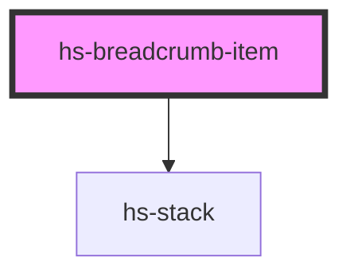

# hs-breadcrumb-item

<!-- Auto Generated Below -->

## Properties

| Property     | Attribute    | Description | Type      | Default     |
| ------------ | ------------ | ----------- | --------- | ----------- |
| `href`       | `href`       |             | `string`  | `undefined` |
| `isLastItem` | `islastitem` |             | `boolean` | `false`     |
| `name`       | `name`       |             | `string`  | `undefined` |

## Dependencies

### Depends on

- [hs-stack](../hs-stack)

### Graph

----------------------------------------------

*Built with [StencilJS](https://stenciljs.com/)*
