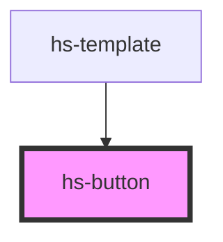

# hs-button

<!-- Auto Generated Below -->

## Properties

| Property   | Attribute  | Description | Type                                         | Default     |
| ---------- | ---------- | ----------- | -------------------------------------------- | ----------- |
| `disabled` | `disabled` |             | `boolean`                                    | `false`     |
| `size`     | `size`     |             | `string`                                     | `"medium"`  |
| `variant`  | `variant`  |             | `"payment" \| "pill" \| "primary" \| "text"` | `"primary"` |

## Events

| Event     | Description | Type               |
| --------- | ----------- | ------------------ |
| `clicked` |             | `CustomEvent<any>` |

## Dependencies

### Used by

 - [hs-template](../hs-template)

### Graph

----------------------------------------------

*Built with [StencilJS](https://stenciljs.com/)*
