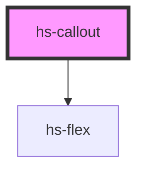

# hs-callout

<!-- Auto Generated Below -->

## Properties

| Property | Attribute | Description | Type                               | Default  |
| -------- | --------- | ----------- | ---------------------------------- | -------- |
| `type`   | `type`    |             | `"info" \| "success" \| "warning"` | `"info"` |

## Dependencies

### Depends on

- [hs-flex](../hs-flex)

### Graph

----------------------------------------------

*Built with [StencilJS](https://stenciljs.com/)*
