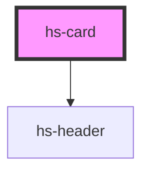

# hs-card

<!-- Auto Generated Below -->

## Properties

| Property  | Attribute | Description | Type                  | Default     |
| --------- | --------- | ----------- | --------------------- | ----------- |
| `content` | `content` |             | `string`              | `undefined` |
| `header`  | `header`  |             | `string`              | `undefined` |
| `image`   | `image`   |             | `string`              | `undefined` |
| `type`    | `type`    |             | `"medium" \| "small"` | `"small"`   |

## Dependencies

### Depends on

- [hs-header](../hs-header)

### Graph

----------------------------------------------

*Built with [StencilJS](https://stenciljs.com/)*
