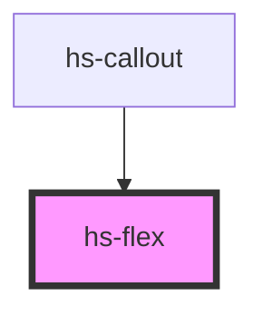

# hs-flex

<!-- Auto Generated Below -->

## Properties

| Property    | Attribute   | Description | Type                                                                                  | Default    |
| ----------- | ----------- | ----------- | ------------------------------------------------------------------------------------- | ---------- |
| `direction` | `direction` |             | `"column" \| "row"`                                                                   | `"row"`    |
| `gap`       | `gap`       |             | `number`                                                                              | `0`        |
| `wrap`      | `wrap`      |             | `boolean`                                                                             | `false`    |
| `xAlign`    | `xalign`    |             | `"baseline" \| "center" \| "end" \| "start" \| "stretch"`                             | `"center"` |
| `yAlign`    | `yalign`    |             | `"center" \| "end" \| "space-around" \| "space-between" \| "space-evenly" \| "start"` | `"center"` |

## Dependencies

### Used by

 - [hs-callout](../hs-callout)

### Graph

----------------------------------------------

*Built with [StencilJS](https://stenciljs.com/)*
