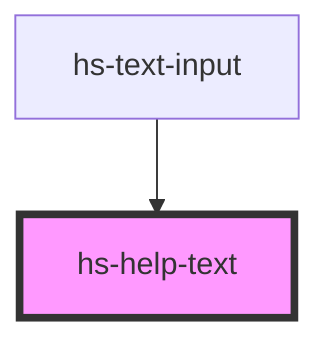

# hs-help-text

<!-- Auto Generated Below -->

## Properties

| Property | Attribute | Description | Type                                             | Default     |
| -------- | --------- | ----------- | ------------------------------------------------ | ----------- |
| `type`   | `type`    |             | `"error" \| "primary" \| "success" \| "warning"` | `"primary"` |

## Dependencies

### Used by

 - [hs-text-input](../hs-text-input)

### Graph

----------------------------------------------

*Built with [StencilJS](https://stenciljs.com/)*
