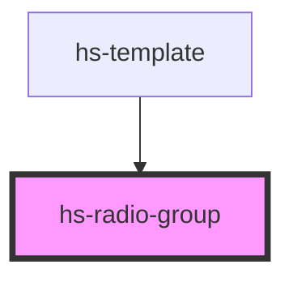

# hs-radio-group

<!-- Auto Generated Below -->

## Properties

| Property   | Attribute  | Description | Type  | Default     |
| ---------- | ---------- | ----------- | ----- | ----------- |
| `name`     | `name`     |             | `any` | `undefined` |
| `selected` | `selected` |             | `any` | `undefined` |

## Dependencies

### Used by

 - [hs-template](../hs-template)

### Graph

----------------------------------------------

*Built with [StencilJS](https://stenciljs.com/)*
