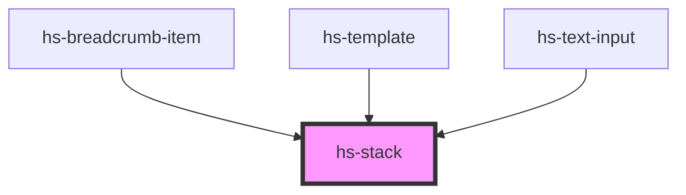

# hs-stack

<!-- Auto Generated Below -->

## Properties

| Property      | Attribute     | Description | Type                         | Default        |
| ------------- | ------------- | ----------- | ---------------------------- | -------------- |
| `gap`         | `gap`         |             | `number`                     | `0`            |
| `orientation` | `orientation` |             | `"horizontal" \| "vertical"` | `"horizontal"` |

## Dependencies

### Used by

 - [hs-breadcrumb-item](../hs-breadcrumb)
 - [hs-template](../hs-template)
 - [hs-text-input](../hs-text-input)

### Graph

----------------------------------------------

*Built with [StencilJS](https://stenciljs.com/)*
