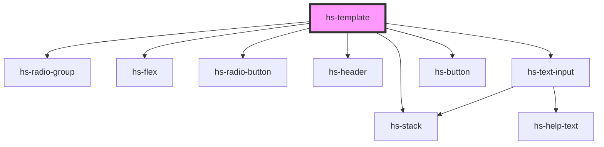

# hs-template

<!-- Auto Generated Below -->

## Dependencies

### Depends on

- [hs-radio-group](../hs-radio-group)
- [hs-flex](../hs-flex)
- [hs-radio-button](../hs-radio-group)
- [hs-header](../hs-header)
- [hs-stack](../hs-stack)
- [hs-text-input](../hs-text-input)
- [hs-button](../hs-button)

### Graph

----------------------------------------------

*Built with [StencilJS](https://stenciljs.com/)*
