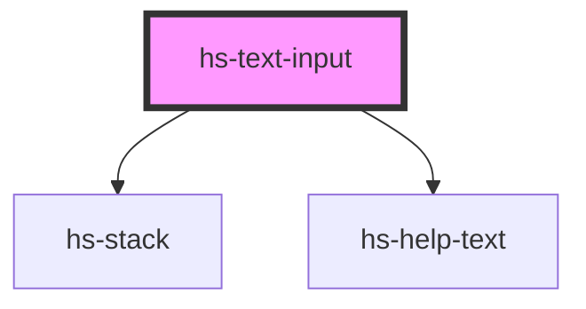

# hs-text-input

<!-- Auto Generated Below -->

## Properties

| Property          | Attribute           | Description | Type                                             | Default     |
| ----------------- | ------------------- | ----------- | ------------------------------------------------ | ----------- |
| `disabled`        | `disabled`          |             | `boolean`                                        | `false`     |
| `helpText`        | `help-text`         |             | `boolean`                                        | `false`     |
| `helpTextContent` | `help-text-content` |             | `string`                                         | `undefined` |
| `label`           | `label`             |             | `string`                                         | `undefined` |
| `placeholder`     | `placeholder`       |             | `string`                                         | `undefined` |
| `type`            | `type`              |             | `"error" \| "primary" \| "success" \| "warning"` | `"primary"` |

## Dependencies

### Depends on

- [hs-stack](../hs-stack)
- [hs-help-text](../hs-help-text)

### Graph

----------------------------------------------

*Built with [StencilJS](https://stenciljs.com/)*
